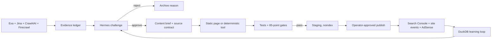

# HomeNet Fit — Complete Pre-Build Plan

**Prepared:** 2026-09-14
**Niche:** U.S. consumer home-network compatibility and upgrade planning
**Research score:** 85/100 — passed without changing the original weights
**Revenue gate:** passed as potential, not forecast
**Status:** BUILD APPROVED — LOCAL TOOLS 1–3 AND FIRST CONTENT EXPANSION COMPLETE
**Spend, domain purchase, deployment, publishing, and service activation:** none

## 1. Decision

Build one focused utility and information site that answers:

> Will my ISP, plan, modem or gateway, router or mesh system, cabling, and devices work together—and what should I upgrade first?

The working brand is **HomeNet Fit**. The primary promise is:

> **Find what works together. Fix the actual bottleneck. Buy only what helps.**

This is a source-backed compatibility and decision engine. It is not a generic networking blog, a speed-test clone, a subnet-calculator collection, an affiliate “best router” site, or a system that pretends to remotely inspect equipment it cannot see.

The category has demonstrated enough traffic to make the locked $500/month AdSense goal plausible. RouterSecurity reported 342,720 pageviews in its latest published 30-day period, while SpeedGuide reports more than six million monthly pageviews and says it uses AdSense for remnant inventory.[^1][^2] Those sites prove that the audience exists; they do not forecast traffic or revenue for HomeNet Fit.

### Locked score

| Criterion | Maximum | Score |
|---|---:|---:|
| Low competition / weak SERPs | 20 | 14 |
| Search demand | 15 | 15 |
| Useful tool opportunities | 15 | 15 |
| Advertiser value | 10 | 9 |
| Evergreen potential | 10 | 8 |
| Ability to create clearly better content | 10 | 8 |
| Long-tail opportunity | 10 | 10 |
| Low operational/risk burden | 5 | 1 |
| AdSense suitability | 5 | 5 |
| **Total** | **100** | **85** |

The low maintenance score is intentional. Hardware revisions, firmware, ISP approval lists, aliases, and dated compatibility rules must be maintained. The opportunity passes because the useful tool depth and fragmented decision path outweigh that burden.

## 2. Existing Zo systems to reuse

No second research engine, content engine, LLM router, database, design-reference system, or deployment platform should be created.

| Need | Existing Zo capability | Exact reuse | Small missing adapter after approval |
|---|---|---|---|
| Research coordination | Shared Research Core and Hermes Mission Control patterns | Reuse the Exa → Jina → Crawl4AI → Firecrawl evidence chain | Home-network query and source schemas |
| Discovery | Exa plus four-source fallback logic | Find official ISP, vendor, standards, and support sources | Domain/source allowlists by fact type |
| Page extraction | Jina → local Crawl4AI → Firecrawl | Free-first reading with Firecrawl only when required | Cache and revalidation schedule |
| Reasoning and veto | Hermes through the existing OpenAI-compatible bridge | Challenge opportunities, compatibility rules, pages, tools, winners, and losers | Home-network QA rubric |
| Design research | Existing authenticated Mobbin MCP | Search flows, screens, and page sections for interaction patterns | None; the integration is now verified |
| Content building | Existing prompt loader, content patterns, metadata logic, and QA gates | Produce briefs, explanations, examples, FAQs, metadata, and internal-link suggestions | Utility-page output contract |
| Coding and testing | Bun/TypeScript, static-site patterns, existing test harnesses | Deterministic compatibility functions and fixture tests | New project-specific rules and data |
| Technical SEO | Existing SEO audit and SEO-data skills | Crawlability, canonical, sitemap, schema, metadata, and index-control checks | Site-specific routes and checks |
| Analytics | Existing analytics DuckDB and read-only dataset patterns | Store Search Console, site, tool, AdSense, and revision summaries | New tables and import jobs |
| Operational telemetry | Hermes activity database | Runs, costs, errors, and artifacts only | Keep separate from visitor analytics |
| Storage | JSON/JSONL evidence plus DuckDB | Versioned open data and reproducible decisions | Home-network entity/rule files |
| Hosting | GitHub and connected Cloudflare | Standalone static Cloudflare Pages site | New repository/project only after approval |
| Optional distribution | Existing Postiz rule | Later organic posts only if approved | Not part of website deployment |

The AI Content Engine remains paused. Its code and patterns may be reused, but its workers, services, schedulers, and automations must not be resumed. Fiction Studio and Roughdraft Studio remain untouched.

The parked `Projects/preflight-bench/` niche remains rejected. Its static generator and test organization may be used as patterns, but its name, content, formulas, pages, and deployment state do not carry forward.

### Connected operating flow



## 3. Brand and domain direction

### Recommended name

**HomeNet Fit**

- Clear enough to understand without being a keyword-stuffed exact-match name.
- Broad enough for ISP, modem, router, mesh, Ethernet, MoCA, Wi-Fi client, and upgrade decisions.
- “Fit” communicates compatibility without claiming measurement or certification.
- Works with the recurring result language: “Your setup fits,” “fits with conditions,” or “does not fit.”

### Domain candidates

Read-only Verisign RDAP checks on 2026-09-14 returned no registration record for the first four names below. That is not a reservation or purchase guarantee; availability and trademark clearance must be rechecked immediately before any purchase.

1. `homenetfit.com` — preferred.
2. `networkpathfinder.com` — strongest descriptive fallback.
3. `homenetplanner.com` — clear but less distinctive.
4. `homenetworkready.com` — clear but longer.

Do not buy any domain during the planning phase.

### Message hierarchy

- **Homepage headline:** Find what works together.
- **Subhead:** Check your ISP, internet plan, gateway, router, mesh, wiring, and devices as one connected path.
- **Primary CTA:** Check my network.
- **Secondary CTA:** Find my bottleneck.
- **Proof line:** Source-backed answers with the date and assumptions shown.
- **Trust promise:** HomeNet Fit recommends keeping what already works.

## 4. Product boundary

### HomeNet Fit will do

- Ask only for information required to answer the current decision.
- Evaluate the network as a chain, not as isolated product specifications.
- Return **compatible**, **compatible with conditions**, **incompatible**, or **unknown**.
- Identify the first limiting link and the cheapest useful action.
- Explain assumptions, evidence, source date, and confidence.
- Preserve an unknown result when official evidence is missing or conflicting.
- Use official ISP, manufacturer, standards-body, and certification sources wherever possible.
- Provide crawlable explanations, examples, and related decision paths around every tool.

### HomeNet Fit will not do

- Pretend to scan a router, Wi-Fi signal, or home remotely.
- Promise real-world throughput from specifications alone.
- Generate model × ISP doorway pages with small word substitutions.
- Publish unverified compatibility inferred from a similar model.
- Present affiliate commissions as neutral recommendations.
- Rank hardware using manufacturer marketing claims alone.
- Clone speed tests, IP tools, subnet calculators, or broad “best router” lists.
- Recommend replacement when configuration, a cable, or a single port fixes the limitation.

## 5. Mobbin design research

The existing Mobbin MCP was used directly. No browser login or separate Mobbin setup is needed.

| Reference | Pattern worth using | What HomeNet Fit changes |
|---|---|---|
| Quicken homepage hero[^3] | One direct promise, one primary action, and visual proof beside the copy | Replace lifestyle imagery with an interactive network-path preview |
| Zendesk recommendation flow[^4] | One question per step, icon cards, visible progress, back/next controls, explained recommendation | Use conditional questions so users never answer irrelevant hardware fields |
| Codecademy quiz flow[^5] | Bold split-screen question treatment and obvious progress | Keep the clarity but remove the loud color blocking and promotional tone |
| Revolut Business setup flow[^6] | Persistent stage checklist for a longer setup | Use a small desktop progress rail; collapse it to a compact step label on mobile |
| Whereby connection result[^7] | A plain-language status first, followed by overview and improvement tips | Add the source-backed network path and limiting-link explanation |
| Lovable audit result[^8] | Category scores, grouped findings, and clear actions | Replace generic scores with compatibility states and evidence confidence |
| Vanta issue table[^9] | “OK” versus “Needs attention,” searchable details, strong status labels | Use for model rules and source records; convert rows to stacked cards on mobile |
| Dovetail comparison table[^10] | Filter chips, searchable columns, and scannable status tags | Use for hardware comparisons without turning the site into a shopping catalog |

### Original design concept: Network Path Map

The distinctive visual element is a horizontal network chain:

```text
ISP plan → modem/gateway → router/mesh → wired/wireless link → client device
```

Each link displays one status and one verified ceiling. The first limiting or incompatible link is emphasized. Selecting a link opens its reason, evidence, and cheapest useful next action. The result remains fully readable as text without the graphic.

This combines the useful hierarchy of the references but does not reproduce any one screen, brand, layout, copy, or visual identity.

## 6. Original design system

### Visual direction

Calm technical clarity: light, precise, human, and trustworthy. The page should feel like a well-made consumer diagnostic—not enterprise security software and not an electronics storefront.

### Tokens

| Token | Value | Use |
|---|---|---|
| Canvas | `#F6F8FB` | Site background |
| Surface | `#FFFFFF` | Cards, tool panels, table surfaces |
| Ink | `#102235` | Primary text |
| Muted ink | `#5E6B78` | Secondary explanations |
| Primary | `#2764E7` | Main action, selected state, links |
| Information | `#0F8B8D` | Neutral evidence and topology |
| Compatible | `#16794B` | Pass state |
| Conditional | `#A45D00` | Conditions or limitations |
| Incompatible | `#B42318` | Failed requirement |
| Unknown | `#64748B` | Missing or conflicting evidence |
| Border | `#D7DEE8` | Dividers and control boundaries |

Color is never the only status signal. Every state also uses an icon and a text label.

### Typography

- **Primary:** Instrument Sans, self-hosted and subsetted.
- **Evidence/specification labels:** IBM Plex Mono, self-hosted and used sparingly.
- Base text: 16px with 1.55 line height.
- Tool-page H1: clamp from 32px to 48px.
- Section H2: clamp from 24px to 32px.
- Evidence labels: 12–13px, never used for long prose.
- Maximum reading width: 72 characters; maximum tool canvas: 1200px.

### Spacing and components

- Eight-pixel spacing system: 4, 8, 12, 16, 24, 32, 48, 64.
- Cards: 12px radius, 1px border, minimal shadow only for the active panel.
- Buttons: 44px minimum target height; one filled primary, one outlined secondary.
- Inputs: labels above fields, helper text below, errors adjacent to the field and summarized at the top.
- Tables: sticky header on desktop; stacked labeled cards below 720px.
- Status chips: icon + word + short condition, never color alone.
- Loading: skeleton only for optional model lookup; deterministic calculations are immediate.
- Empty state: explain exactly which input starts the result.
- Unknown state: provide the missing evidence and a safe manual-check path.

### Tool layout

**Desktop:** 360–400px guided input rail on the left; flexible result canvas on the right.
**Mobile:** inputs → verdict → network path → bottleneck → recommended action → assumptions and evidence → alternatives → related tool.

### Result hierarchy

1. Plain-language verdict.
2. What the verdict means.
3. Network Path Map.
4. First limiting or incompatible link.
5. Cheapest useful next action.
6. Assumptions, confidence, and dated sources.
7. Alternative configurations.
8. Related tool or supporting guide.

## 7. Information architecture

### Primary navigation

- **Check My Network** — whole-network planner.
- **Compatibility** — ISP, modem, router, mesh, client, and MoCA tools.
- **Bottlenecks** — plan-speed, ports, Ethernet, and device limits.
- **Mesh & Wi-Fi** — generations, family mixing, placement, and backhaul.
- **Wiring** — Ethernet, coax, MoCA, splitters, and topology.
- **Guides** — explanations and examples.
- **Methodology** — evidence, confidence, updates, corrections.

### Homepage structure

1. Hero promise and “Check my network” action.
2. Interactive five-link Network Path Map preview.
3. Three common decisions: “Will it work?”, “What is slowing it down?”, “What should I change first?”
4. Primary tools.
5. How source-backed decisions work.
6. Popular ISP and equipment guides.
7. Recent source updates.
8. Methodology and correction link.
9. Footer with About, Contact, Privacy, Terms, Cookie Information, Editorial Standards, and Sitemap.

Every important page stays within two or three clicks of the homepage.

## 8. Source and compatibility data contract

### Core records

| Record | Required fields |
|---|---|
| Provider | `provider_id`, name, service types, regions, official support URL |
| Plan | `plan_id`, provider, advertised tier, access technology, gateway requirements, dates |
| Equipment | `equipment_id`, brand, canonical model, aliases, hardware revision, category |
| Capability | equipment, interface/band/standard, supported value, conditions, evidence |
| Compatibility rule | subject, relationship, object, status, conditions, exception, dates |
| Source | URL, title, publisher, publication/update date, retrieval date, evidence note, content hash |
| Decision fixture | user inputs, expected status, expected limiter, expected action, source set |

### Status contract

- `compatible`: every required rule is supported by current evidence.
- `conditional`: it works only with a stated mode, port, adapter, service condition, or lost feature.
- `incompatible`: a required capability or approved-equipment rule fails.
- `unknown`: evidence is missing, ambiguous, conflicting, model-specific, or too stale.

### Evidence requirements

- Every compatibility fact links to a source record.
- Official ISP, manufacturer, standards-body, and certification sources outrank forums or retailers.
- Secondary sources may identify a question but cannot silently become authoritative evidence.
- Each rule stores `last_verified`, `next_review`, reviewer, and confidence.
- ISP approval lists and firmware-sensitive rules are reviewed at least monthly.
- Stable standards and physical-interface rules are reviewed every six months unless a correction arrives.
- Any source change creates a diff and re-runs affected fixtures before publication.
- Conflicting sources produce `unknown` or `conditional`, never an invented resolution.
- Competitor copy and page structure are not imported. Only independently verified facts are normalized.

Official sources already demonstrate why this layer is needed: Xfinity maintains its own approved-equipment finder; T-Mobile documents third-party router and mesh arrangements; TP-Link distinguishes proprietary mesh families; NETGEAR documents multi-gig port requirements; and MoCA installation guidance adds topology and component conditions.[^11][^12][^13][^14][^15]

## 9. First 10 tools

The first three tools validate the central product.

**Correction, 2026-09-14 (supersedes the original gate):** this section and §16 originally gated Tools 4–10 on Search Console impressions, which contradicted the §19 AdSense floor of five tools and 20 supporting pages — impressions require deployment, and deployment was never authorized. Tools 4, 5, and 6 were built under the §19 reading without that conflict being reported at the time. The reconciled rule: build to the §19 floor while local, then stop. Past six tools, no further tool ships without Search Console query evidence.

### Tool 1 — Whole-Network Compatibility and Upgrade Planner

- **Purpose:** Decide whether the user's full network path works together and identify the first worthwhile change.
- **Target searches:** “router compatibility checker for ISP,” “does my router support my internet plan,” “home network compatibility checker.”
- **Inputs:** ISP, service type, plan tier, modem/gateway model, router or mesh model, wired link, client model/capabilities, current topology.
- **Outputs:** overall status, five-link path, first limiting link, configuration requirements, cheapest next action, assumptions, confidence, dated sources.
- **Function:** normalize model aliases; resolve provider rules; compute the minimum verified ceiling across required links; apply topology conditions; stop on incompatibility; preserve unknown evidence; rank actions `keep < configure < add/rewire < replace` when outcomes are equivalent.
- **Desktop layout:** guided input rail beside the Network Path Map and result explanation.
- **Mobile layout:** one question per step; verdict and limiting link appear before expanded evidence.
- **Supporting content:** modem/router/gateway definitions, realistic speed paths, source methodology, worked examples.
- **Related tools:** bottleneck finder, ISP equipment checker, upgrade-priority planner.
- **Limitation:** no claim about measured Wi-Fi speed, interference, or coverage without user-supplied observations.

### Tool 2 — Internet-Plan Bottleneck Finder

- **Purpose:** Show why a paid internet tier may not reach a particular wired or wireless device.
- **Target searches:** “network bottleneck calculator,” “why am I not getting gigabit speed,” “does router support 2 gig internet.”
- **Inputs:** plan tier, gateway WAN/LAN ports, router WAN/LAN ports, switch port, cable category/link rate, access-point link, Wi-Fi generation/channel width, client link.
- **Outputs:** theoretical path ceiling, first limiter, other downstream limits, whether an upgrade can change the result, test steps.
- **Function:** convert every verified component to a comparable link ceiling; take the minimum; distinguish interface line rate from expected application throughput; never generate a precise Wi-Fi speed prediction.
- **Desktop layout:** editable path across the top, limiter explanation and action list below.
- **Mobile layout:** vertical path with the first limiter pinned under the verdict.
- **Supporting content:** port labels, 1 GbE versus 2.5 GbE, wired test procedure, protocol overhead caveat.
- **Related tools:** Ethernet checker, Wi-Fi client lookup, whole-network planner.
- **Limitation:** outputs capability limits, not a remote performance diagnosis.

### Tool 3 — ISP Modem and Own-Router Checker

- **Purpose:** Determine whether a modem, gateway, or customer-owned router is allowed and what features may change.
- **Target searches:** “approved modem for [ISP],” “use my own router with [ISP],” “mesh with T-Mobile Home Internet.”
- **Inputs:** ISP, access technology, service tier, voice/TV service, equipment model, desired own-router or bridge/AP setup.
- **Outputs:** approved/conditional/not approved/unknown, supported services, required gateway mode, lost-feature warnings, official source.
- **Function:** match provider/service/equipment/date; apply plan, voice, TV, region, and gateway-mode exceptions; never generalize one ISP's approval to another.
- **Desktop layout:** concise form, result card, official evidence, setup paths, alternative tool links.
- **Mobile layout:** provider first, then only questions relevant to that provider and service.
- **Supporting content:** ownership versus rental, bridge/IP passthrough/AP modes, model verification instructions.
- **Related tools:** whole-network planner, topology decision guide, bottleneck finder.
- **Limitation:** final activation eligibility remains the ISP's decision and can change.

### Tool 4 — Mesh-Family Compatibility Checker

- **Purpose:** Determine whether two mesh units, routers, or extenders can form one managed mesh and what fallback remains.
- **Target searches:** “can different mesh brands work together,” “Wi-Fi 6 and Wi-Fi 7 mesh compatibility,” “[model] compatible with [model].”
- **Inputs:** brand, product family, exact models, hardware revisions, firmware, desired shared SSID/roaming/backhaul behavior.
- **Outputs:** same managed mesh, conditional mixed system, access-point fallback, separate network, or unknown; lost features and setup path.
- **Function:** evaluate family membership before Wi-Fi generation; apply published mixed-generation, EasyMesh, wired-backhaul, firmware, and role rules.
- **Desktop layout:** side-by-side products with a relationship verdict between them.
- **Mobile layout:** stacked product cards followed by verdict and feature-loss list.
- **Supporting content:** EasyMesh versus proprietary mesh, roaming, backhaul, firmware verification.
- **Related tools:** Wi-Fi client lookup, topology guide, placement planner.
- **Limitation:** shared Wi-Fi standards do not prove shared mesh management.

### Tool 5 — Wi-Fi 6/6E/7 and 6-GHz Client Capability Lookup

- **Purpose:** Explain which bands and features a specific client can actually use.
- **Target searches:** “does my laptop support 6 GHz,” “[device] Wi-Fi 6E support,” “Wi-Fi 7 device compatibility.”
- **Inputs:** device model, region, OS version, wireless adapter, router security/band settings.
- **Outputs:** supported generation, bands, channel-width limit, security/OS conditions, expected fallback, upgrade relevance.
- **Function:** merge model, adapter, OS, regulatory, and security prerequisites; return unknown when the exact hardware configuration cannot be distinguished.
- **Desktop layout:** searchable model lookup with a capability matrix and conditions.
- **Mobile layout:** search, primary capability card, expandable evidence rows.
- **Supporting content:** generation naming, 6 GHz requirements, MLO caveats, how to find an adapter model.
- **Related tools:** bottleneck finder, mesh checker, upgrade-priority planner.
- **Limitation:** capability is not a measured throughput or range claim.

### Tool 6 — MoCA Topology and Splitter Checker

- **Purpose:** Determine whether an existing coax layout can support MoCA and which components or conflicts need attention.
- **Target searches:** “MoCA compatibility checker,” “MoCA with cable internet,” “MoCA splitter compatibility.”
- **Inputs:** cable/fiber/satellite service, coax branches, modem/gateway location, adapter locations, splitter frequencies, amplifiers, filters, TV service.
- **Outputs:** compatible/conditional/incompatible/unknown topology, blocked paths, filter needs, component checklist, annotated diagram.
- **Function:** model coax paths; test frequency and passivity conditions; apply provider coexistence rules; flag unverified splitters/amplifiers instead of assuming passage.
- **Desktop layout:** simple topology builder beside an annotated coax map.
- **Mobile layout:** room-by-room questions followed by a vertical connection diagram.
- **Supporting content:** point-of-entry filters, splitter labels, cable versus fiber cases, safety boundary.
- **Related tools:** topology planner, Ethernet checker, whole-network planner.
- **Limitation:** users should not open provider enclosures or perform unsafe coax work.

### Tool 7 — Ethernet Link and Port Bottleneck Checker

- **Purpose:** Evaluate the complete wired link instead of answering only whether a cable category can support a speed.
- **Target searches:** “does Cat5e support 2.5 Gbps,” “router port speed for gigabit,” “Ethernet bottleneck checker.”
- **Inputs:** endpoint NICs, router/switch ports, cable category, estimated length, negotiated link rate, adapters/docks.
- **Outputs:** negotiated ceiling, expected link, mismatch causes, cheapest test or replacement order.
- **Function:** the lowest negotiated or supported interface wins; cable category is a condition, not the only determinant; show verification steps before recommending replacement.
- **Desktop layout:** component chain and evidence table.
- **Mobile layout:** vertical link cards with the limiter expanded.
- **Supporting content:** auto-negotiation, bad-pair fallback, USB dock limits, cable-label reading.
- **Related tools:** bottleneck finder, Wi-Fi lookup, upgrade-priority planner.
- **Limitation:** physical cable damage cannot be confirmed without testing.

### Tool 8 — Router/AP/Bridge and Double-NAT Decision Guide

- **Purpose:** Choose a topology that avoids unnecessary routing layers while preserving required ISP features.
- **Target searches:** “bridge mode vs access point mode,” “double NAT fix,” “use mesh with existing gateway.”
- **Inputs:** ISP gateway requirement, user-owned router/mesh, TV/voice service, desired controls, available bridge/IP-passthrough/AP modes.
- **Outputs:** recommended topology, exact roles, cable path, double-NAT risk, tradeoffs, provider-specific cautions.
- **Function:** deterministic decision tree selects one routing authority when possible; preserves provider gateway when required; presents conditional alternatives instead of one universal answer.
- **Desktop layout:** decision questions beside before/after topology diagrams.
- **Mobile layout:** one question per step and a single recommended diagram.
- **Supporting content:** NAT, DHCP, AP mode, bridge mode, IP passthrough, ISP feature dependencies.
- **Related tools:** ISP checker, mesh checker, whole-network planner.
- **Limitation:** device administration steps remain model-specific and source-linked.

### Tool 9 — Mesh-Node Count and Placement Planner

- **Purpose:** Produce a cautious placement range based on layout and backhaul—not a false square-foot formula.
- **Target searches:** “how many mesh nodes do I need,” “mesh node placement,” “Wi-Fi coverage by square feet.”
- **Inputs:** floor area, floors, shape, wall materials, gateway location, weak rooms, wired backhaul availability, node family.
- **Outputs:** starting node range, suggested first placements, backhaul priorities, validation walk-through, uncertainty level.
- **Function:** rules-based placement starts with geometry and obstacles; wired backhaul changes placement constraints; never predicts dBm or exact throughput without measurements.
- **Desktop layout:** simple floor-zone canvas plus ordered placement actions.
- **Mobile layout:** room/obstacle questionnaire and ordered placement cards; no precision drawing required.
- **Supporting content:** node spacing, over-meshing, wired backhaul, validation with device readings.
- **Related tools:** mesh checker, topology guide, upgrade-priority planner.
- **Limitation:** every home has unmodeled interference and construction differences.

### Tool 10 — Upgrade-Priority Planner

- **Purpose:** Prevent unnecessary purchases by ranking only changes that can improve the user's stated problem.
- **Target searches:** “what should I upgrade first router or modem,” “home network upgrade order,” “do I need a new router for faster internet.”
- **Inputs:** current setup from Tool 1, problem type, affected devices/rooms, budget band, ability to run cable, test observations.
- **Outputs:** keep list, free configuration actions, low-cost fixes, later upgrades, “do not buy yet” items, evidence and expected scope of change.
- **Function:** consume verified limits and conditions; rank by problem relevance, dependency order, cost class, and confidence; exclude upgrades blocked by an earlier limiter.
- **Desktop layout:** prioritized action ladder with before/after path.
- **Mobile layout:** one action at a time with reason, cost class, and verification step.
- **Supporting content:** diagnosis before purchase, testing sequence, common wasted upgrades.
- **Related tools:** every preceding diagnostic tool.
- **Limitation:** cost bands are dated ranges, not real-time prices, unless a future price source is explicitly approved.

## 10. First 30 target query families

These are acquisition families, not promises of rank or measured search volume. Broad strong-SERP terms serve as support pages or tool inputs; the launch focuses on fragmented and gap intent.

| # | Query family | SERP state | Primary destination |
|---:|---|---|---|
| 1 | modem compatible with Xfinity | Strong | Tool 3 + source guide |
| 2 | approved modem for Spectrum | Fragmented | Tool 3 |
| 3 | modem for Cox gigabit | Fragmented | Tool 3 |
| 4 | own router with AT&T Fiber | Fragmented | Tools 3 and 8 |
| 5 | mesh with T-Mobile Home Internet | Fragmented | Tools 3 and 8 |
| 6 | own router with Verizon Fios | Fragmented | Tools 3 and 8 |
| 7 | router for 1-gig internet | Strong | Tool 2; avoid listicle |
| 8 | router for 2-gig internet | Strong | Tool 2; avoid listicle |
| 9 | does my router support my plan speed | Gap | Tools 1 and 2 |
| 10 | Wi-Fi 6E device compatibility | Fragmented | Tool 5 |
| 11 | Wi-Fi 7 device compatibility | Fragmented | Tool 5 |
| 12 | does my laptop support 6 GHz | Gap | Tool 5 |
| 13 | mesh compatible with existing router | Fragmented | Tools 4 and 8 |
| 14 | can different mesh brands work together | Gap | Tool 4 |
| 15 | Wi-Fi 6 and Wi-Fi 7 mesh together | Fragmented | Tool 4 |
| 16 | bridge mode vs access point mode | Fragmented | Tool 8 |
| 17 | double NAT checker and fix | Fragmented | Tool 8 |
| 18 | modem vs router vs gateway | Strong | Supporting guide |
| 19 | MoCA compatibility checker | Gap | Tool 6 |
| 20 | MoCA with cable internet | Fragmented | Tool 6 |
| 21 | MoCA splitter compatibility | Gap | Tool 6 |
| 22 | Cat5e gigabit or 2.5 Gbps checker | Fragmented | Tool 7 |
| 23 | does Cat5e support 2.5 Gbps | Fragmented | Tool 7 + guide |
| 24 | network link-speed bottleneck calculator | Gap | Tool 2 |
| 25 | router port speed for gigabit plan | Fragmented | Tools 2 and 7 |
| 26 | home-network topology planner | Gap | Tools 1 and 8 |
| 27 | mesh-node placement calculator | Fragmented | Tool 9 |
| 28 | how many mesh nodes do I need | Fragmented | Tool 9 |
| 29 | Wi-Fi coverage calculator by square feet | Strong | Guide into Tool 9 |
| 30 | router compatibility checker for ISP | Gap | Tools 1 and 3 |

## 11. First 30 supporting pages

Every page must include a direct answer, one useful diagram/table/example where appropriate, dated sources, natural links to its primary tool, and distinct intent. No provider/model keyword-swap pages are authorized.

### ISP and equipment cluster

| # | Proposed URL | Search intent and unique value | Primary tool |
|---:|---|---|---|
| 1 | `/guides/modem-router-gateway/` | Identify each device and who controls routing | 1 |
| 2 | `/guides/use-your-own-router/` | Universal decision tree plus provider-specific branches | 3 |
| 3 | `/guides/approved-modem-lists/` | How to read approval lists, tiers, revisions, voice limits | 3 |
| 4 | `/guides/xfinity-owned-equipment/` | Source-linked process, not a duplicate modem catalog | 3 |
| 5 | `/guides/spectrum-owned-equipment/` | Plan, modem, and router decision path | 3 |
| 6 | `/guides/cox-owned-equipment/` | Approved hardware plus port bottlenecks | 3 |
| 7 | `/guides/att-fiber-own-router/` | Gateway, passthrough, and topology choices | 8 |
| 8 | `/guides/verizon-fios-own-router/` | Internet-only versus TV/MoCA cases | 8 |
| 9 | `/guides/tmobile-home-internet-mesh/` | Third-party mesh arrangements and limitations | 8 |
| 10 | `/guides/router-for-multigig-plan/` | Full link-chain requirements without product ranking | 2 |

### Mesh and Wi-Fi cluster

| # | Proposed URL | Search intent and unique value | Primary tool |
|---:|---|---|---|
| 11 | `/guides/easymesh-vs-proprietary-mesh/` | Explain why common Wi-Fi standards do not guarantee one mesh | 4 |
| 12 | `/guides/mix-mesh-brands/` | Managed mesh, AP fallback, and separate-network outcomes | 4 |
| 13 | `/guides/mix-wifi-generations/` | Client and mesh backward compatibility versus feature loss | 4 |
| 14 | `/guides/wifi-6e-6ghz-requirements/` | Router, client, OS, security, and regional prerequisites | 5 |
| 15 | `/guides/wifi-7-compatibility/` | What works now, what falls back, and what needs exact verification | 5 |
| 16 | `/guides/find-wifi-adapter-model/` | OS-specific steps that feed an accurate capability lookup | 5 |
| 17 | `/guides/mesh-node-placement/` | Placement logic based on paths, floors, and obstacles | 9 |
| 18 | `/guides/how-many-mesh-nodes/` | Explain ranges and why square footage alone fails | 9 |
| 19 | `/guides/wired-vs-wireless-backhaul/` | Decision table, cabling constraints, and expected benefits | 9 |
| 20 | `/guides/too-many-mesh-nodes/` | Diagnose over-meshing, roaming, and interference symptoms | 9 |

### Wiring, ports, MoCA, and topology cluster

| # | Proposed URL | Search intent and unique value | Primary tool |
|---:|---|---|---|
| 21 | `/guides/cat5e-gigabit-multigig/` | Cable capability plus ports, length, condition, and negotiation | 7 |
| 22 | `/guides/ethernet-link-negotiation/` | Explain why a link falls to 100 Mbps or 1 Gbps | 7 |
| 23 | `/guides/wan-lan-port-speeds/` | Show how one port can cap a faster internet tier | 2 |
| 24 | `/guides/usb-dock-ethernet-limits/` | Include adapters and docks in the real wired path | 7 |
| 25 | `/guides/moca-with-cable-internet/` | Coexistence, path, filter, and provider considerations | 6 |
| 26 | `/guides/moca-splitter-labels/` | Read frequencies, ports, amplification, and certification | 6 |
| 27 | `/guides/moca-point-of-entry-filter/` | Purpose, placement concepts, and safe boundaries | 6 |
| 28 | `/guides/bridge-ap-ip-passthrough/` | Compare modes by routing role and ISP constraint | 8 |
| 29 | `/guides/double-nat/` | Identify topology causes and choose a correction | 8 |
| 30 | `/guides/home-network-upgrade-order/` | Test and dependency order before buying hardware | 10 |

### Trust pages outside the 30

- `/about/`
- `/contact/`
- `/methodology/`
- `/editorial-standards/`
- `/corrections/`
- `/privacy/`
- `/terms/`
- `/cookies/`
- `/sources/`
- `/changelog/`

## 12. Internal-linking structure

- Every guide links to one primary tool near the first useful decision point, not only at the end.
- Every tool links to its input explanations, evidence methodology, two adjacent tools, and two worked examples.
- ISP pages link to Tool 3, then to topology and bottleneck paths when relevant.
- Mesh pages link across family compatibility, client capability, placement, and topology—never to unrelated broad topics.
- Wiring pages link from physical path → negotiated link → whole-network bottleneck → upgrade priority.
- Result pages provide two context-specific next actions rather than a generic “related articles” grid.
- Breadcrumbs reflect actual hierarchy and use matching `BreadcrumbList` structured data.[^16]
- Orphan checks run in the build. Every indexed page must have at least two internal links in and two useful links out unless it is a policy page.

## 13. Technical architecture

### Stack

- Standalone project after approval; do not overwrite zo.space or another project.
- Bun + TypeScript static generator.
- Semantic static HTML for every page's main explanation, source summary, examples, and links.
- Small framework-free client JavaScript for tool state and results.
- Versioned JSON data and test fixtures in the repository.
- Cloudflare Pages for hosting; static-asset requests are free and unlimited, while any later Functions usage would count against Workers quotas.[^17]
- GitHub for source control and deployment integration.
- No database, account system, login, upload, server rendering, or API required for the initial site.

### Proposed route structure

```text
/
/check/
/compatibility/
/bottlenecks/
/mesh-wifi/
/wiring/
/guides/
/tools/<tool-slug>/
/guides/<guide-slug>/
/methodology/
/sources/
/about/
/contact/
/privacy/
/terms/
/cookies/
```

### SEO requirements

- One self-canonical URL per finished page; Google recommends canonical signals for duplicate or very similar URLs.[^18]
- XML sitemap contains only canonical, useful, indexable pages; submit it through Search Console.[^19]
- `robots.txt` points to the sitemap and does not substitute for `noindex`.
- Staging and unfinished pages stay `noindex` and out of the sitemap.
- Unique title, meta description, H1, Open Graph metadata, and contextual internal links.
- Important content exists in generated HTML before interaction.
- Breadcrumb structured data only when it matches visible navigation.
- No fabricated review, product, FAQ, or dataset schema.
- Custom 404 routes users back to the relevant category or tool.

### Performance and accessibility budgets

- Core Web Vitals targets at the 75th percentile: LCP at or below 2.5 seconds, INP at or below 200 milliseconds, and CLS at or below 0.1.[^20]
- Under 80 KB compressed JavaScript on ordinary tool pages unless measurement justifies more.
- No client framework on guide-only pages.
- Reserve dimensions for diagrams, images, and future ad slots.
- Self-host and subset fonts; use system fallbacks immediately.
- Minimum 44px interactive targets.
- Full keyboard operation, visible focus, correct labels, error summary, and result announcements.
- Text equivalent for every path diagram and status.
- Comparison tables become labeled cards on narrow screens.
- Test at 360px, 768px, 1280px, reduced motion, keyboard only, and 200% zoom.

## 14. Automation and quality control

### Safe automation flow

1. Research Core discovers a query or stale fact.
2. The source reader captures official evidence and retrieval metadata.
3. A normalizer proposes entity aliases, capability facts, and compatibility rules.
4. Deterministic validation rejects missing sources, invalid dates, unsupported statuses, and orphan entities.
5. Hermes challenges the rule, page brief, duplication, and user value.
6. The content builder produces a brief and draft grounded only in the approved evidence packet.
7. The coding system builds or updates deterministic logic and fixtures.
8. Tests cover compatible, conditional, incompatible, unknown, alias, revision, and stale-source cases.
9. Mobile, desktop, accessibility, SEO, source, and originality reviews run on staging.
10. Only a passing tool and an 85+ page can enter the production branch.
11. Publishing remains operator-approved during calibration.
12. Search Console and tool events drive expand, improve, merge, or retire decisions.

### Page publishing score

| Criterion | Weight |
|---|---:|
| Search intent match | 20 |
| Unique value | 20 |
| Accuracy | 15 |
| Usefulness | 15 |
| SEO opportunity | 10 |
| Readability | 10 |
| Internal linking | 5 |
| Technical quality | 5 |
| **Minimum** | **85/100** |

Independent blockers override the numeric score:

- Unsupported compatibility, specification, provider, price, or standards claim.
- Near-duplicate page intent.
- Competitor-derived language or organization.
- Broken tool behavior or failing fixture.
- Missing mobile, keyboard, source, or performance review.
- Placeholder, dead link, hidden primary content, or deceptive function.

Google's guidance prioritizes helpful, reliable, people-first content and warns against extensive automation that mainly manipulates rankings.[^21] AI therefore accelerates evidence processing, drafting, coding, tests, and updates; it does not create unsupported pages or publish at scale without value.

## 15. Analytics and learning loop

### Initial measurement

- Google Search Console for indexing, queries, pages, clicks, impressions, CTR, and position. Search Console is free and is the primary organic-search feedback source.[^22]
- Cloudflare Web Analytics for privacy-focused site traffic and page performance.[^23]
- First-party aggregate tool events: start, completion, status, unknown result, evidence expansion, next-action click, and related-tool click.
- No stored network credentials, IP addresses, device serial numbers, SSIDs, or free-text configuration dumps.
- AdSense reporting only after approval and real ad traffic.

### Existing DuckDB extensions after approval

- `search_console_page_daily`
- `search_console_query_daily`
- `web_traffic_daily`
- `tool_events`
- `adsense_daily`
- `source_freshness`
- `page_revisions`
- `opportunity_decisions`

Hermes operational activity stays in `data/hermes_activity.db`; visitor analytics does not.

### Weekly decisions

- **Expand:** a page ranks 5–20, earns relevant clicks, or repeatedly sends users into a completed tool.
- **Improve:** high impressions with weak CTR, high tool abandonment, frequent unknown results, or a missing adjacent query.
- **Merge:** two pages answer the same intent without distinct value.
- **Retire/noindex:** inaccurate, obsolete, unsupported, or persistently irrelevant material.
- **Do not explain failure with “SEO takes time.”** Check indexing, intent, title/CTR, source coverage, functionality, internal links, competition, and demand.

## 16. Launch sequence after build approval

### Days 1–3

- Create the standalone project and DOX file.
- Lock brand tokens, route map, data schema, source priority, and compatibility statuses.
- Build responsive homepage/tool/result prototypes from the original design system.
- Create fixtures for Tools 1–3 before writing production logic.

### Days 3–7

- Build the shared static shell and Tool 2 bottleneck engine first because its core is deterministic.
- Build the source-led ISP rules required by Tool 3.
- Build Tool 1 by composing verified rules from Tools 2 and 3—not by duplicating logic.
- Draft the first six supporting guides and all trust-page structures.
- Keep everything local and `noindex`.

### Days 7–14

- Complete Tools 1–3 and at least 10–12 substantive guides.
- Run tool, source, originality, mobile, desktop, accessibility, performance, and technical-SEO gates.
- Prepare Cloudflare Pages configuration, sitemap, robots, canonical, redirects, and 404.
- Publish only after a separate deployment/domain decision.
- Verify Search Console and submit the sitemap after the real domain is live.

### Days 15–30

- Finish 20 supporting pages if the first three tools are stable.
- Inspect indexing and query impressions.
- Improve pages already receiving relevant impressions before opening new clusters.
- Build additional tools beyond the §19 floor only when query evidence supports it. See the correction note in §9.
- Do not apply to AdSense just because the site is online.

### Days 30–90

- Expand toward 8–10 tools and 24–30 strong pages based on actual query and usage data.
- Refresh provider and firmware-sensitive sources on schedule.
- Run the full AdSense audit once the site is complete, useful, navigable, indexed, and free of placeholders.
- Expand winners and cut weak paths.

Google notes that indexing can take from a day to much longer and that requesting a crawl does not guarantee inclusion.[^24] The day ranges above are execution targets, not indexing or revenue guarantees.

## 17. Traffic and revenue scenarios

These are planning ranges, not forecasts. Revenue uses $5–$10 page-RPM sensitivity only; actual RPM, fill, approval timing, traffic mix, and ad layout are unknown. Google defines page RPM as estimated earnings divided by pageviews and multiplied by 1,000.[^25]

| Time | Conservative monthly organic pageviews | Moderate | Breakout |
|---|---:|---:|---:|
| 30 days | 0–200 | 100–800 | 500–2,000 |
| 60 days | 100–800 | 800–3,000 | 3,000–12,000 |
| 90 days | 300–2,000 | 3,000–12,000 | 15,000–50,000 |
| 6 months | 3,000–15,000 | 25,000–75,000 | 100,000–350,000 |
| 12 months | 10,000–40,000 | 60,000–180,000 | 300,000–1,000,000 |

| Time | Conservative AdSense sensitivity | Moderate | Breakout |
|---|---:|---:|---:|
| 30 days | $0 | $0 | $0 |
| 60 days | $0 | $0 | $0–$50 |
| 90 days | $0 | $0–$120 | $0–$500 |
| 6 months | $0–$150 | $125–$750 | $500–$3,500 |
| 12 months | $50–$400 | $300–$1,800 | $1,500–$10,000 |

The locked $500/month target requires roughly 50,000 monthly pageviews at a $10 page RPM or 100,000 at $5. The moderate case reaches that zone during months 6–12; the conservative case does not. The breakout case requires several tools or query clusters to earn materially stronger distribution and should not be treated as the expected case.

AdSense review timing is not controlled by the site; Google says review often takes a few days but can take two to four weeks.[^26]

## 18. Cost plan

| Item | Startup | Recurring | Decision |
|---|---:|---:|---|
| `.com` domain | $10–$20 | $10–$20/year | Purchase only after explicit approval and final recheck |
| Cloudflare Pages | $0 | $0 | Static hosting target |
| GitHub repository | $0 | $0 | Reuse connected GitHub |
| Search Console | $0 | $0 | Primary search feedback |
| Bing Webmaster Tools | $0 | $0 | Optional secondary search setup |
| Cloudflare Web Analytics | $0 | $0 | Initial traffic analytics |
| Email forwarding | $0 | $0 | Cloudflare Email Routing if the domain is purchased[^27] |
| Hermes local review | $0 incremental | $0 incremental | Fail closed rather than silently use paid fallback |
| Research stack | $0 new contract | Existing usage only | Cache, bound calls, and keep Firecrawl as controlled fallback |
| Mobbin | $0 new contract | Existing account | Current integration already works |
| Keyword provider | $0 | Not authorized | Use Search Console after launch; do not invent volume |
| **Expected total** | **$10–$20** | **approximately $0/month plus annual domain** | No spend yet |

No recurring paid service is required for the initial site. If future evidence shows a paid keyword or specification source is necessary, it requires a separate proposal stating cost, free alternative, and expected decision value.

## 19. AdSense readiness and implementation

Google does not publish a fixed page-count requirement. It does require original, high-quality content and pages with clear navigation and enough unique value for users.[^28][^29] The counts below are HomeNet Fit's internal quality floor, not a Google rule.

### Application threshold

- Minimum five complete tools and 20 substantive supporting pages.
- Preferred eight tools and 24–30 supporting pages.
- All trust and policy pages complete.
- Every indexed page scores at least 85/100.
- Every tool passes functionality, source, mobile, accessibility, and performance gates.
- Search Console confirms crawl/index health and shows relevant query impressions.
- No placeholder, test, duplicate, unsupported, or orphan pages.

### Readiness checklist

#### Site and access

- [ ] Custom domain works over HTTPS.
- [ ] Search Console ownership is verified.
- [ ] Sitemap is submitted and contains only finished canonical URLs.
- [ ] AdSense crawler can access all intended content without login.
- [ ] 404, redirect, canonical, and `noindex` behavior is verified.

#### Content and originality

- [ ] Site purpose is obvious on the homepage and every tool.
- [ ] Tools work and explain inputs, outputs, assumptions, limitations, and examples.
- [ ] Every compatibility claim has dated evidence.
- [ ] No scraped, spun, doorway, city-swap, model-swap, or paraphrased competitor pages.
- [ ] AI drafts receive factual, originality, and human-quality review.
- [ ] Supporting pages add diagrams, tables, examples, or decision help beyond summary text.

#### Navigation and experience

- [ ] Every important page is within two or three clicks.
- [ ] No broken links, empty categories, placeholders, or dead controls.
- [ ] Mobile tools work at 360px and 200% zoom.
- [ ] Error, empty, loading, reset, compatible, conditional, incompatible, and unknown states work.
- [ ] The site remains fully useful without ads.

#### Policy and privacy

- [ ] About, Contact, Privacy, Terms, Cookies, Methodology, Editorial Standards, Corrections, Sources, and Changelog are live.
- [ ] Privacy language accurately discloses analytics and Google advertising data use.
- [ ] A Google-certified consent-management platform is configured when required for personalized ads in the EEA, UK, and Switzerland.[^30]
- [ ] No prohibited content, deceptive claim, or sensitive targeting.

#### Traffic and ad safety

- [ ] Traffic is organic and attributable.
- [ ] No own-ad clicks, requested clicks, bots, exchanges, purchased traffic, or deceptive sources.
- [ ] Ads are visually separate from navigation, inputs, buttons, diagrams, results, and copy controls.
- [ ] Space is reserved to prevent layout shift.
- [ ] Tool completion, engagement, INP, CLS, pages/session, and repeat visits are monitored after ads.

Google warns against layouts that place ads too close to heavily used controls or otherwise encourage accidental clicks.[^31] HomeNet Fit therefore starts with at most one clearly separated unit after the complete result explanation and one later in-content unit on long guides. No ad belongs inside the Network Path Map, between an input and action, beside a reset/copy button, or inside a changing result panel.

## 20. Build approval and current boundary

This document completes the requested pre-build decision package:

- Existing Zo reuse map.
- Hermes, Firecrawl, Mobbin, content, build, analytics, storage, and publishing roles.
- Selected 85/100 niche and revenue basis.
- Original brand and design system.
- Information architecture and homepage.
- First 30 query families.
- First 10 tool specifications.
- First 30 supporting pages.
- Technical architecture.
- Automation and quality gates.
- Traffic and revenue scenarios.
- Cost and AdSense readiness plans.

Build approval was received on 2026-09-14. The approved local action is complete:

> `Projects/homenet-fit/` now contains the standalone Bun/TypeScript static project, shared decision contracts, Tools 1–3, 21 passing unit tests, 18 ISP rules across six provider systems, 14 official or first-party source records, 12 supporting guides, 15 passing publication gates, trust pages, local noindex controls, and generated-site verification.

The project remains local and globally noindex. Domain purchase, public deployment, Search Console setup, analytics activation, AdSense application, paid calls, and paused-service activation remain separate approvals.

## Sources

[^1]: https://www.routersecurity.org/stats.php
[^2]: https://www.speedguide.net/advertising.php
[^3]: https://mobbin.com/sites/sections/c0a45bad-39fb-490e-972a-ffd56ae4cd19
[^4]: https://mobbin.com/flows/fc697b1e-d935-4802-b96d-938d510e3a49
[^5]: https://mobbin.com/flows/cc8b6454-74f3-4ea1-bd63-e58fb7e30217
[^6]: https://mobbin.com/flows/2837a3f6-6751-4b45-9488-5f60d4489f1f
[^7]: https://mobbin.com/screens/039df2f6-bfd5-40ca-b552-b62ae057f336
[^8]: https://mobbin.com/screens/91e4caa2-3908-478a-92e5-50ed9843795d
[^9]: https://mobbin.com/screens/eb1d71b4-2b3c-4a83-8435-bdc0e7cbb9e2
[^10]: https://mobbin.com/screens/832e5719-7133-4733-a7d2-87061364df60
[^11]: https://www.xfinity.com/support/internet/customerowned
[^12]: https://www.t-mobile.com/support/home-internet/connect
[^13]: https://www.tp-link.com/us/support/faq/3749/
[^14]: https://kb.netgear.com/en_US/000059677/
[^15]: https://mocalliance.org/technology/Final_Best-Practices-for-Installation-of-MoCA_170516rev01.pdf
[^16]: https://developers.google.com/search/docs/appearance/structured-data/breadcrumb
[^17]: https://developers.cloudflare.com/pages/functions/pricing/
[^18]: https://developers.google.com/search/docs/crawling-indexing/consolidate-duplicate-urls
[^19]: https://developers.google.com/search/docs/crawling-indexing/sitemaps/overview
[^20]: https://web.dev/articles/vitals
[^21]: https://developers.google.com/search/docs/fundamentals/creating-helpful-content
[^22]: https://support.google.com/webmasters/answer/9128668?hl=en
[^23]: https://developers.cloudflare.com/web-analytics/about/
[^24]: https://support.google.com/webmasters/answer/9012289?hl=en
[^25]: https://support.google.com/adsense/answer/190515?hl=en
[^26]: https://support.google.com/adsense/answer/7584263?hl=en
[^27]: https://developers.cloudflare.com/email-service/configuration/email-routing-addresses/
[^28]: https://support.google.com/adsense/answer/9724?hl=en
[^29]: https://support.google.com/adsense/answer/7299563?hl=en
[^30]: https://support.google.com/adsense/answer/13554020?hl=en
[^31]: https://support.google.com/adsense/answer/16737?hl=en
